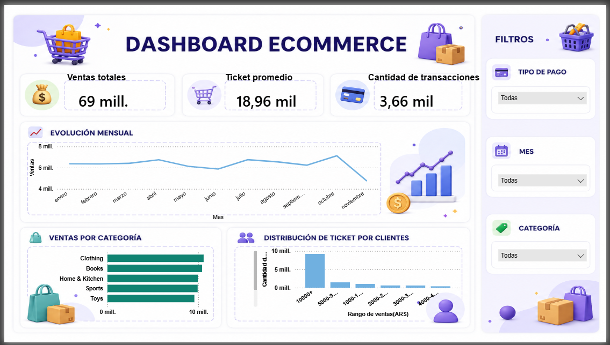

# 📊 Dashboard de E‑commerce con Python, SQL y Power BI

## 🚀 Descripción
Este proyecto muestra un flujo completo de **análisis de datos de e‑commerce**, desde la limpieza y consultas en Python/SQL hasta la construcción de un **dashboard interactivo en Power BI**.  
El objetivo fue obtener insights sobre ventas, categorías, clientes y métodos de pago.

---

## 🛠️ Tecnologías utilizadas
- **Python** → Limpieza de datos, análisis exploratorio y generación de gráficos iniciales.  
- **SQL** → Consultas para KPIs clave (ventas totales, ticket promedio, transacciones, top productos).  
- **Power BI** → Creación del dashboard final con visualizaciones interactivas y segmentadores.

---

## 📈 KPIs principales
- **Ventas Totales**  
- **Ticket Promedio**  
- **Cantidad de Transacciones**  
- **Top Productos y Categorías**  
- **Distribución del Ticket por Cliente**

---

## 📊 Visualizaciones en Power BI
- Evolución mensual de ventas (línea).  
- Ventas por categoría (barras).  
- Métodos de pago (dona).  
- Distribución del ticket por cliente (histograma).  
- Top 10 productos más vendidos (barras horizontales).  
- Segmentadores: Mes, Categoría, Tipo de Pago.

---

## 🖼️ Captura del Dashboard

---

## ✅ Conclusiones del Dashboard

- **Ventas Totales:** Alcanzaron los **69 millones**, mostrando un crecimiento sólido en el período analizado.  
- **Ticket Promedio:** Se mantiene en torno a **18,96 mil**, lo que refleja un nivel de gasto estable por transacción.  
- **Cantidad de Transacciones:** Con más de **3,66 mil operaciones**, se evidencia un volumen significativo de actividad en la plataforma.  

### 📈 Insights clave
- La **evolución mensual** muestra un incremento constante, con picos claros en determinados meses, lo que sugiere **estacionalidad en las compras**.  
- En **ventas por categoría**, destacan **Clothing y Home & Kitchen** como las más fuertes, seguidas por Sports y Toys, lo que marca las preferencias de los clientes.  
- La **distribución del ticket por clientes** revela que la mayoría de los compradores realizan tickets bajos, mientras que un grupo reducido concentra tickets altos, indicando un patrón de **clientes mayoristas vs minoristas**.  
- Los **filtros de pago, mes y categoría** permiten identificar tendencias específicas y segmentar el análisis para decisiones más precisas.

---

👉 En resumen: el negocio muestra **crecimiento sostenido**, con categorías líderes y un ticket promedio estable. La segmentación por clientes y métodos de pago abre oportunidades para **estrategias de marketing personalizadas** y optimización de ventas.

---

## 📌 Cómo usar
1. Clonar este repositorio.  
2. Abrir el archivo `Dashboard_Ecommerce.pbix` en **Power BI Desktop**.  
3. Revisar el código SQL y Python en las carpetas `/sql` y `/python`.  
4. Explorar el dashboard y aplicar filtros para obtener insights.

---

## 👨‍💻 Autor
Proyecto realizado por **Benjamín**, combinando Python, SQL y Power BI para análisis de datos y visualización interactiva.
